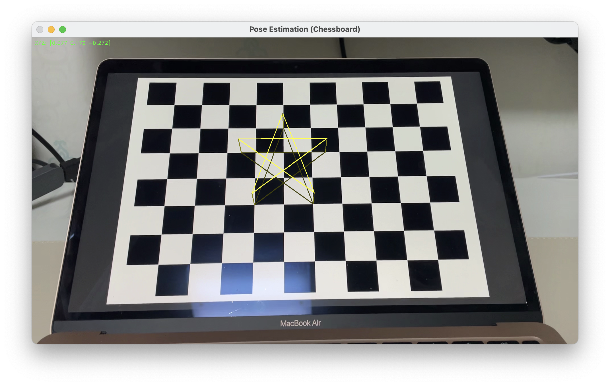

# simpleAR_with_opencv

camera calibration on chessboard image and simple AR with python opencv

### calibration result with implementing camera_calibration.py

- K =  
  [1.66545464e03, 0.00000000e00, 9.63191669e02],  
  [0.00000000e00, 1.66478960e03, 5.28436841e02],  
  [0.00000000e00, 0.00000000e00, 1.00000000e00]
- dist_coefficient =  
  [2.17038905e-01, -1.11778713e00, -3.21833581e-04, 6.37111795e-04, 2.30756867e00]

### screenshot

